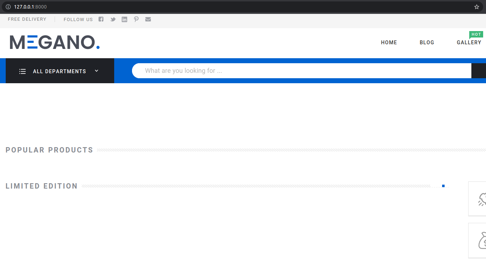

## Подключение пакета
1. **Собрать пакет:** в директории `frontend` выполнить команду:
   ```bash
   python setup.py sdist
   ```

2. **Установить** полученный пакет в виртуальное окружение:
   ```bash
   pip install dist/frontend-X.Y.tar.gz
   ```
   X и Y - числа, они могут изменяться в зависимости от текущей версии пакета.

3. **Установка зависимостей:**
   В активированном виртуальном окружении установите зависимости проекта с помощью команды:
   ```bash
   pip install -r requirements.txt
   ```

4. **Применение миграций:**
   Выполните миграции для создания базы данных:

   ```bash
   python manage.py migrate
   ```

5. В `settings.py` проекта подключить приложение:
   ```python
   INSTALLED_APPS = [
      ...
      "frontend",
   ]
   ```

6. В `urls.py` добавить:
   ```python
   urlpatterns = [
   path("", include("frontend.urls")),
   ...
   ]
   ```

7. **Загрузка фикстур:**
   Загрузите фикстуры с помощью следующих команд:

   ```bash
   python manage.py loaddata fixtures/user_fixture.json
   python manage.py loaddata fixtures/app_users-fixture.json
   python manage.py loaddata fixtures/app_products-fixture.json
   python manage.py loaddata fixtures/app_orders-fixture.json
   ```
   Эти команды загрузят данные из предоставленных фикстур, включая суперпользователя: `username: admin`, `password: admin` и пользователя: `логин: john`, `пароль: 123456`.

8. **Запуск сервера:**
   Запустите сервер разработки Django:

   ```bash
   python manage.py runserver
   ```
   После этого вы сможете открыть проект в вашем веб-браузере по адресу http://127.0.0.1:8000/.
   
   Теперь у вас должен быть запущенный проект с загруженными фикстурами. Вы можете использовать учетные данные суперпользователя (admin) или пользователя (john) для входа в систему.
